# Create your own Facebook Messenger bot online 

Facebook launched their Messenger platform to enable bots to converse with users via Facebook Apps and on Facebook Pages. 

You can read the  [documentation](https://developers.facebook.com/docs/messenger-platform/quickstart) the Messenger team prepared.
Unfortunately, it's not tat clear. 

The particularity of this example is that you won't need to install anything. Everything will be online, even your code. 
We will be using a new plateforme for building and deploying the bot for free. 

#Get into the game

A bot in Facebook is represented by a page. You will talk to a bot by sending a message to the facebook page. But it should be authentified in a facebook App. 

So, you should have : a page and an app. 
Let's get started ! 

##LET'S GET STARTED

###Setup the facebook Page : 

Firstly, we should create a facebook page : 

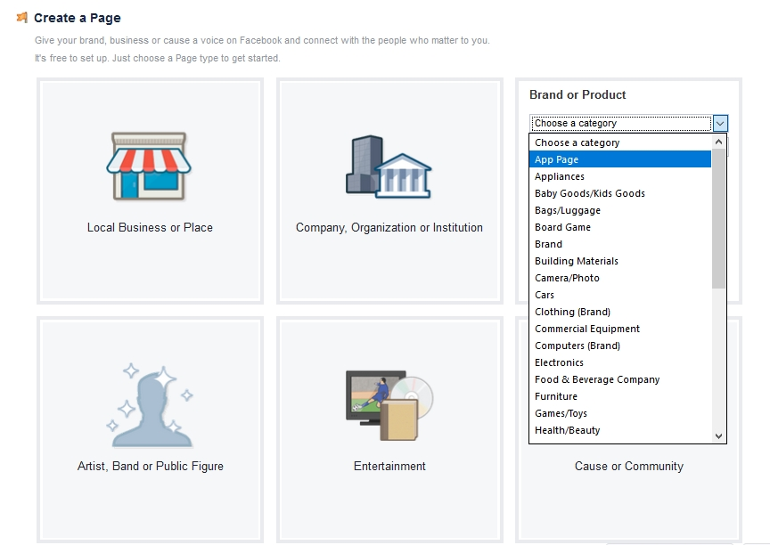

PS : You can skip the steps and save it ;) 

###Setup the facebook app : 
Build your app on : [https://developers.facebook.com/](https://developers.facebook.com/). 

PS : choose the basic setup then "Page for Apps" as a category. 

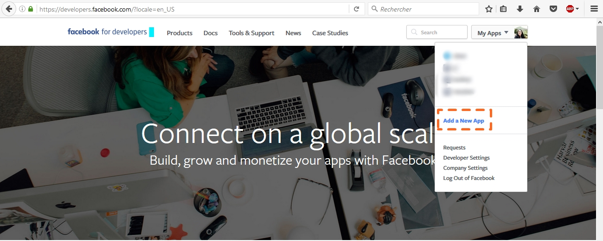

Now that the application is created, you'll have to specify that it's a messenger application : 

Next, let's communicate our application to the facebook page : 

In this step, your bot token will be generated. PS : DO NOT SHARE

You can notice the webhook step under the Token Generation. 

The new thing abt this tutorial, is that we will use that new plateforme I mentioned in the intro. 

###Setup [Gupshup.io](https://https://www.gupshup.io/developer/home/) Bot : 

Gupshup is the "Easiest & fastest way to build & deploy your bots on any channel"

The channels : 

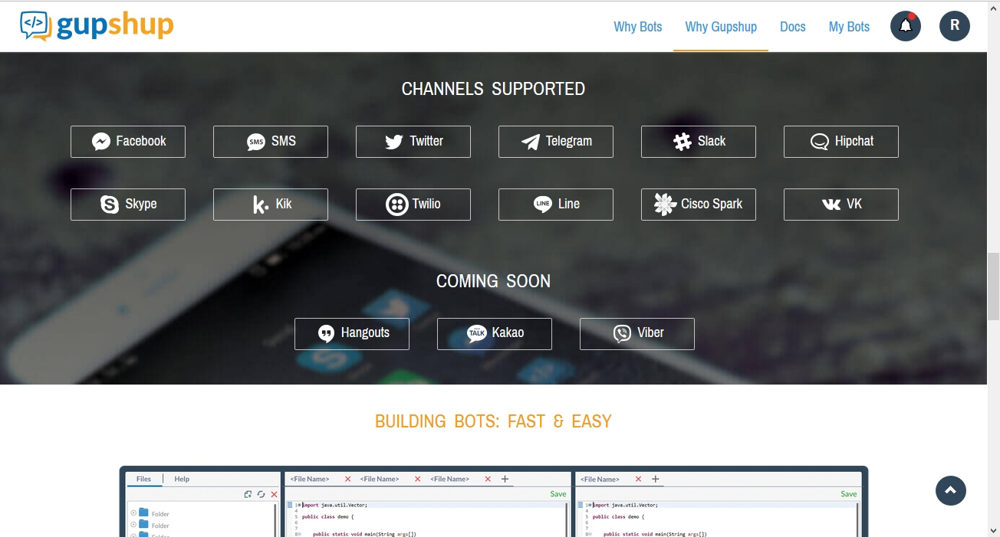

Authentification is done by Github or Facebook. 
Create your bot : 

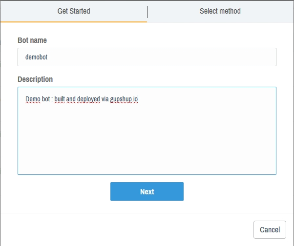

There are many build options : 

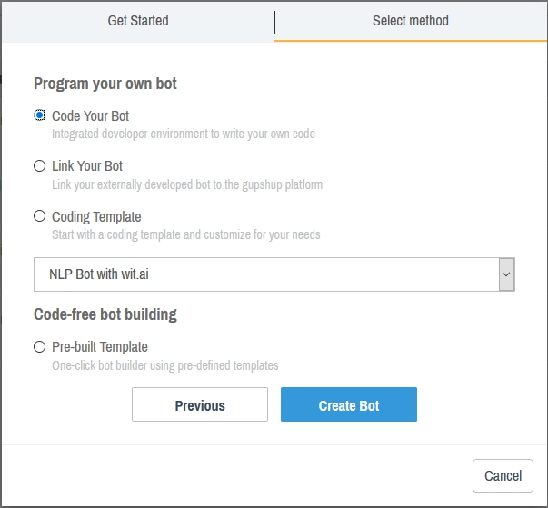

- Code your bot : Gupshup provides an IDE with a real time emulator to test your changes before deploying (we will use this option in this tutorial)
- Link your bot : If you want to code your own code but externely to gupshup, you can link it here 
- Coding Template : Gupshup provides Wit.ai calls for NLP integration. 

Now that you have created your bot, you can easily publish it via gupshup. 
Choose the Facebook Messenger app for publishing : 

This will lead you to a sort of tutorial. 

we will go back to setup the webhook to the messenger App with the one given by gupshup : 

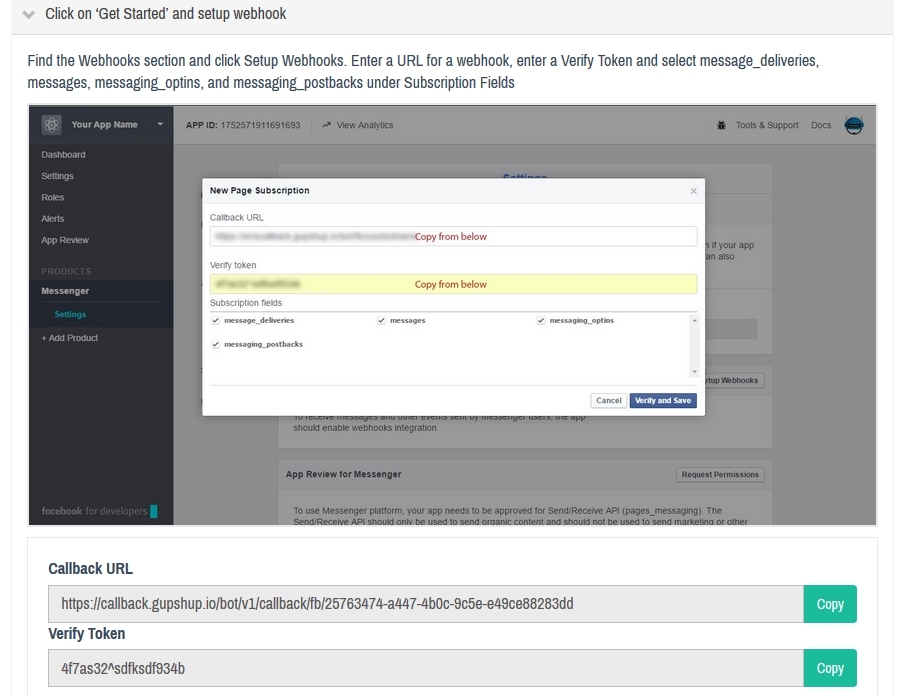

copy and past the webhook url and the verify token to the fields in messenger up webhook setup : 

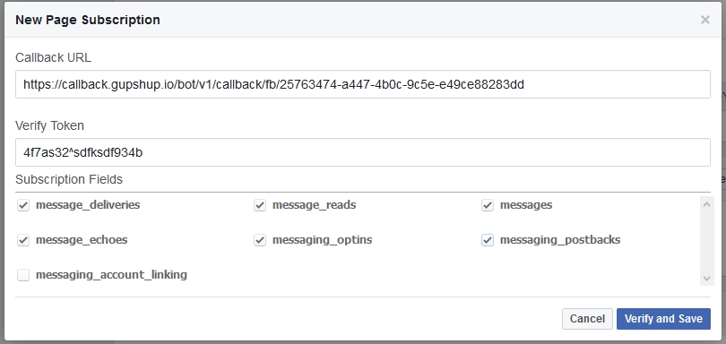

Subscribe your webhooks to your Facebook page : 

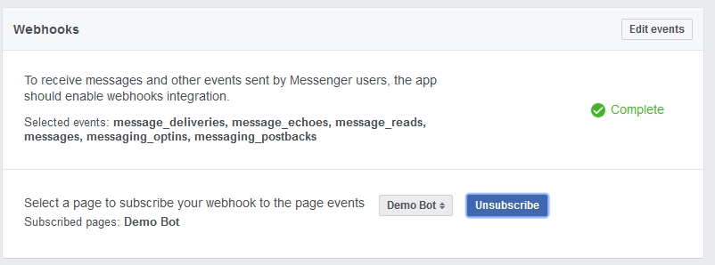

One thing left ! 

###Submit your gupshup deply :
It's the last gupshup tutorial section : 

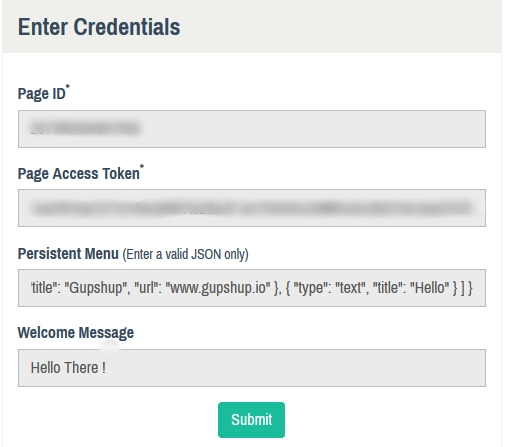

The “Page ID” can be found in the about section of the page.
Page Access Token : is the token we generated above.

If we go back and see the IDE provided by gupshup. I just edited the code by ading the "hi" || "hello". 

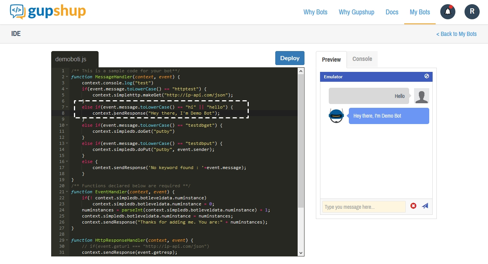

THAT'S IT ! 
Let's try. 

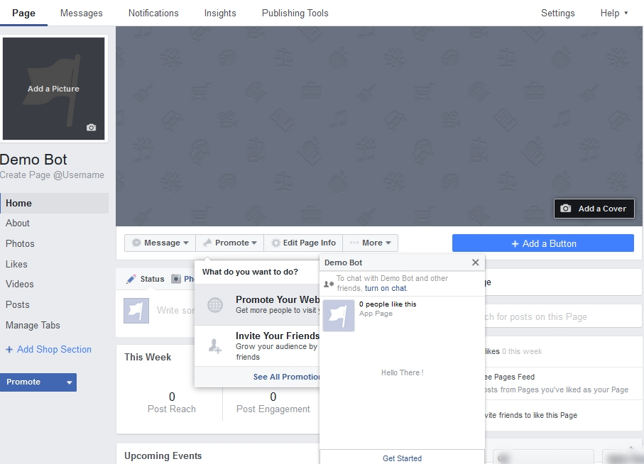

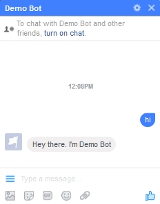

I hope it was helpful. 

See how easy it is to build your bot ? 
Now, the sky is your limit. You can create how many amazing bots as you can. 

## Contribute

Contributions are always welcome!
Please read the [contribution guidelines](contributing.md) first.

## License

To the extent possible under law, [Rania ZYANE](https://twitter.com/raniazy) has waived all copyright and related or neighboring rights to this work.

